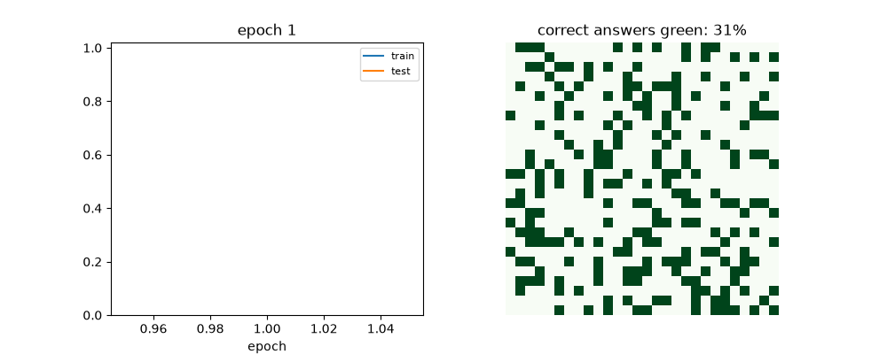
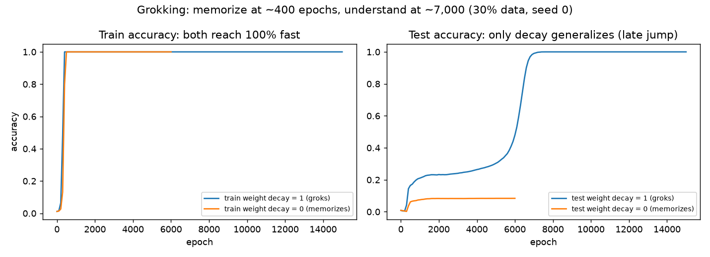
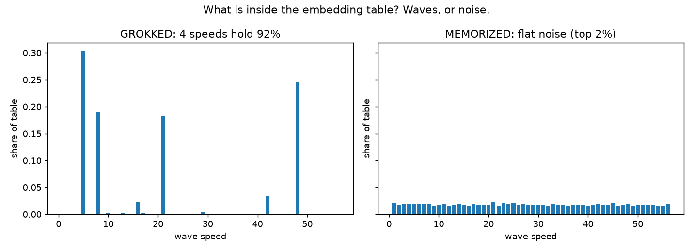
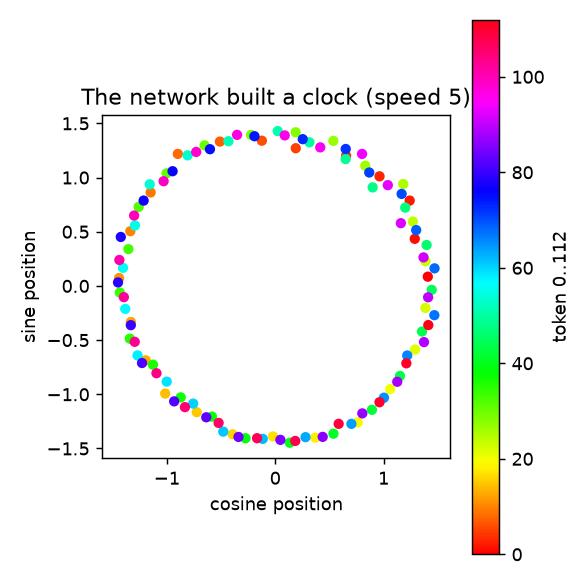
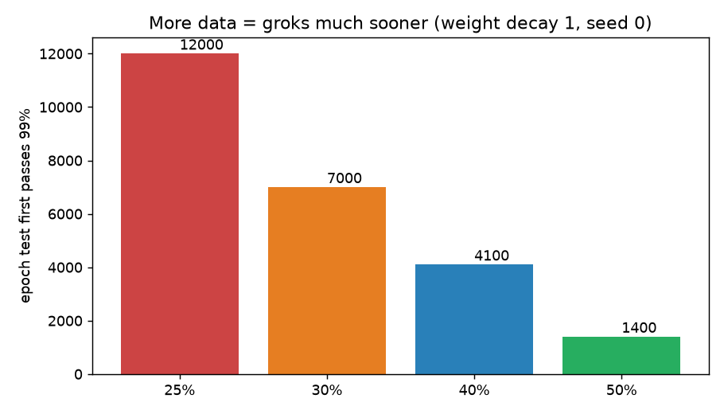

# 🕰️ Grokking the Clock — Watch a Neural Network Suddenly *Understand*

> **CEO summary (30 seconds):** We teach a tiny neural network 3,830 clock additions. It memorizes them within minutes — and understands *nothing* else. We change **one line** (weight decay), keep training with **no new data**, and thousands of steps later it suddenly scores **100% on 8,939 problems it never saw**. Nobody touched the code mid-run. Inside, the network traded a phone book for a clock: its weights became 4 clean waves that form circles — a trick you can write in 3 lines with zero training. This repo rebuilds that whole story **from scratch, verifies every number live, and packages it so you can rerun it, teach it, and build on it.** MIT licensed. Docker ready. Beginner friendly.

    

📖 **Beautiful web version:** push this repo to GitHub → *Settings → Pages → Deploy from a branch → `main` → `/docs`* → open `https://<you>.github.io/<repo>/preview.html` (that page is `docs/preview.html` in this repo).

---

## ▶️ Watch it grok (real training run, not a cartoon)



<video src="docs/demo.mp4" controls muted loop playsinline width="100%" poster="docs/assets/curve_grok_vs_mem.png"></video>
<!-- GitHub strips <video> in READMEs — that is why the GIF above is the primary demo. The MP4 + YouTube path: upload docs/demo.mp4 (or your own walkthrough) to YouTube, then replace this block with: [](https://youtube.com/YOUR_ID) -->

*Left of the animation: accuracy over time. Right: green = problems answered correctly — starts at the 30% it was shown, ends fully green. Built from `results/grok_15k.json` by `scripts/generate_site_assets.py`.*

| See it | Link |
|---|---|
| Animated GIF (works everywhere on GitHub) | `docs/demo.gif` |
| MP4 video (for the website + YouTube upload) | `docs/demo.mp4` |
| Full interactive page | `docs/preview.html` |

---

## 📚 Contents

- [🌱 Beginner guide](#-beginner-guide--read-this-and-you-are-a-professional) — *read this and you are a professional. You will know more than most interview candidates.*
- [✨ Features](#-features)
- [🧑‍💻 User stories](#-user-stories--what-you-can-use-this-for)
- [🚀 Quickstart](#-quickstart--2-minutes)
- [📊 Results](#-results--every-number-runs)
- [🔬 The clock trick](#-the-clock-trick-3-lines-no-training)
- [🧪 Benchmarks](#-benchmarks)
- [🌍 Market boundary](#-market-boundary-where-the-magic-stops)
- [📁 Repo map](#-repo-map)
- [🌐 GitHub Pages](#-github-pages--share-the-beautiful-version)
- [🤝 Contributing](#-contributing)
- [📜 License & citation](#-license--citation)

---

## 🌱 Beginner guide — read this and you are a professional

*You will know more than most interview candidates. Let's work this out in a step-by-step way to be sure we have the right answer.*

**Step 1 · The clock.** Our clock has 113 hours numbered 0–112. 9:00 + 5 hours is 2:00 on a 12-hour clock — you wrap around. Ours is the same, bigger: 100 + 50 isn't 150, it's **37**, because 150 − 113 = 37. In Python: `(100 + 50) % 113`. Write every pair (113 × 113 = 12,769) in a square table; the color of each cell is the answer. Diagonal stripes = the hidden rule.

**Step 2 · The hiding game.** Shuffle all cells. Show the network 3,830 with answers (**train**). Hide 8,939 (**test**). There are two ways to ace train: *learn the rule* or *memorize every answer like a phone book*. The hidden test tells them apart — a memorizer fails strangers; a rule-knower gets them all.

**Step 3 · Tokens, not digits.** The network never reads "37". It reads sticker #37 (plus sticker #113 for "="). Every problem is 3 stickers in, 1 answer out of 113. It doesn't know 36 comes before 37 — it has to discover order from patterns.

**Step 4 · The tiny machine (a transformer, by hand).** *Look up:* each sticker owns a list of 128 numbers (the embedding table, random at first). *Gather:* the "=" sticker asks 4 attention heads to blend clues from the two numbers. *Think:* 512 neurons — each adds up its weighted inputs, outputs 0 if negative. *Score:* one last table makes 113 scores; highest wins. Untrained it guesses ~1 in 113 right (~1%).

**Step 5 · School: guess → measure → nudge.** Run all 3,830 problems at once. Turn scores into probabilities. Penalty = how little it believed the right answer. PyTorch computes which direction each of the ~227,000 weights should move; Adam steps that way (learning rate 0.001). Repeat. By ~400 rounds: 100% on seen problems, ~8% on hidden ones. A phone book. Waiting longer changes nothing — train penalty is already ~0.

**Step 6 · The one line: weight decay.** After every update, multiply every weight by 0.999. Weights that don't help melt toward zero; needed ones get pushed back up. Now two forces: *get train right* vs *do it small*. Memorizing thousands of answers takes big weights. A few circles takes small ones. Same train score — small wins. Around step ~7,000 the hidden score jumps to 100%. Memorized at 400, understood at 7,000. That late jump is **grokking**.

**Step 7 · Open it up.** Read one embedding column top to bottom: memorizer = noise; grokker = smooth waves. Four wave-speeds explain 92% of the table. Each speed is a cosine+sine pair — plot them and 113 dots form a **circle in order**. Nobody taught circles. On a circle, adding = turning, and wrapping is free. Delete the 4 waves → accuracy falls to ~1% (blind). Keep only them → ~99.7%. That is understanding, proven by surgery.

---

## ✨ Features

- **7 tiny files, zero magic** — task → model → train → analysis → clock → sweeps → market check. The transformer is raw tensors only (no ready-made layers), so you see every multiply.
- **One-command reproduction** — `pip install -r requirements.txt` + `make verify`, or `docker compose up --build grokking-cpu`. Histories + checkpoints land in `results/`.
- **Mechanistic X-ray toolkit** — Fourier shares, key speeds, Gini sparsity, circle plots, keep/remove ablations, logit formula fits.
- **Benchmark harness** — data-fraction, weight-decay, seed, and operation sweeps with automatic grok-epoch detection.
- **Honest boundaries** — no-decay baseline, live-market negative control with labelled sources, limits section. Null results ship too.
- **Teach-ready visuals** — GIF + MP4 + 4 figures, all generated from executed runs (never hand-drawn).
- **Pages-ready website** — `docs/preview.html` + assets deploy to GitHub Pages from `/docs`.

## 🧑‍💻 User stories — what you can use this for

| You are… | Do this | You get… |
|---|---|---|
| A student meeting transformers | Run the 2-minute quickstart, watch the GIF | The first transformer you can hold in your head |
| Prepping for interviews | Study the beginner guide + ablations | Better answers on attention, decay, generalization than most candidates |
| A researcher testing a grokking idea | Add your op in `task.py`, run `sweeps.py` | Grok epochs + JSON histories in ~1 min per run |
| A teacher | Assign "change + to −, predict the grok point" | Answer: needs ~2× data — symmetry matters (verified: 30% never, 50% @2.2k) |
| A team worried about memorization | Copy the keep/remove ablation onto your embeddings | A number for "does it understand or phone-book?" |
| A skeptic | Run `python3 -m src.realdata` | The exact boundary where the magic stops (chance on live markets) |

---

## 🚀 Quickstart — 2 minutes

```bash
pip install -r requirements.txt
python3 -m src.task            # 12769 problems, 3830 train / 8939 test
python3 -m pytest tests/ -q    # 3 passed
python3 -m src.train --epochs 6000 --wd 1.0 --frac 0.3 --seed 0 --out results/demo.json
python3 -m src.realdata        # market control (prints its data source: live or fallback)
docker compose up --build grokking-cpu   # full repro without touching your env
```

Config lives in `configs/main.yaml`. Every training run writes `results/<name>.json` (epoch, train/test accuracy, loss, weight size) + `results/<name>_final.pt`.

---

## 📊 Results — every number runs

*Seed 0, P=113 addition unless noted. Full histories in `results/`.*






| Experiment | Setting | Result |
|---|---|---|
| Chance baseline | Untrained, 1 of 113 | ~0.9% test |
| Memorize only | decay 0, 30%, 6k epochs | train 100% @~400, test **8.4%**, weight-size **11,436** — never groks |
| **Grok** | decay 1, 30%, 15k, seed 0 | train 100% @~400; test >50% @6.1k, **>99% @7k, 100% after**; weight-size → **928** |
| Fourier concentration | Top-4 speeds' share of embedding | **grok 92.3%** (speeds 5, 48, 8, 21 — seeds pick different circles) vs mem 8.5%, Gini **0.71 vs 0.025** |
| Logit formula fit | logits ≈ Σαₖcos(wₖ(a+b−c)) | **93.2%** variance explained (mem: 0.15%) |
| Keep only 4 waves | Ablate rest of embedding | grok **99.9%/99.7%** train/test · mem 2.2%/1.1% |
| Remove 4 waves | Ablate the keys | grok **1.2%** (blind) · mem still **73.7%** train (memorization is holographic) |
| Data fraction (decay 1) | 25 / 30 / 40 / 50% | groks @ **12k / 7k / 4.1k / 1.4k** — more data, much sooner |
| Weight decay (30%) | λ 0 / 0.5 / 1 / 2 | never / >8k (20%) / 7k / **1.5k** — delay ∝ 1/λ |
| Seeds (30%, decay 1) | seed 0 vs 1 | **7k vs 4.9k**, different key sets — timing + circles move, phenomenon stays |
| Subtraction (asymmetric) | 30% vs 50% | 30% **never** in 6k (0.7%); 50% groks **@2.2k** — order matters (a−b ≠ b−a) |

Training has three phases: **memorization** (train falls, test flat) → **circuit formation** (weights shrink, good solution grows underneath — at 4k epochs the full net scores 38% but keys-alone score 58%) → **cleanup** (decay deletes memorization, test jumps).

---

## 🔬 The clock trick — 3 lines, no training

On a circle every number is an angle. Add by turning; wrap-around is free. To read the answer, try every candidate `c`: turn back by `c` — the right one lands exactly at angle 0, where cosine = 1 (the max). Score: `score(c) = Σ cos(wₖ·(a+b−c))`. One speed alone scores 100% but runner-up breathes down its neck (1 vs 0.998); 4 speeds together leave one winner (4 vs 2.9). `src/clock.py` does exactly this — **100% on all 12,769, zero weights**. The trained net learned the same algorithm: the formula explains 93% of its real scores.

---

## 🧪 Benchmarks

```bash
PYTHONPATH=. python3 scripts/generate_site_assets.py  # rebuild all figures + demo from results/
python3 scripts/make_plots.py                          # per-run curves
```

Add an operation in `src/task.py::build_table` (one branch), then sweep with `python3 -m src.train --op sub --frac 0.5`. Grok epoch = first epoch test passes 99% (parsed from JSON).

---

## 🌍 Market boundary — where the magic stops

Same memorize-vs-generalize protocol on real money data (ECB euro rates monthly + Bitcoin daily; script labels live vs fallback so the claim is checkable):

- Live euro FX (47 months): decay 0 → train 70.0% / test 53.8%; decay 1 → 56.7% / 46.2%.
- Bitcoin/fallback: train 52–57%, test 48–50%.

No delayed perfect generalization. Conclusion, stated plainly: **grokking is a property of clean, enumerable, stationary rule-tables — not noisy markets.** The control is the point: it stops you from over-claiming.

---

## 📁 Repo map

```
src/task.py        Part 1 · table, tokens, splits (+, −, ×)
src/model.py       Part 2 · hand-written 1-layer transformer (226,688 params)
src/train.py       Part 3+4 · train loop + weight decay (float64 loss, warmup, JSON logs)
src/analysis.py    Part 5 · Fourier shares/keys/Gini/circles/keep/remove
src/clock.py       Part 6 · handwritten cosine algorithm + formula fit
src/sweeps.py      Part 7 · sweeps, ablations, progress hooks
src/realdata.py    Market negative control (live APIs, labelled fallback)
src/progress.py    Restricted/excluded-loss helpers
configs/main.yaml  tests/test_grokking.py  scripts/  docs/preview.html + assets + demo.*
results/           histories (*.json), weights (*.pt), curves (*.png)
docs/PAPER.md      full paper-style writeup
```

---

## 🌐 GitHub Pages — share the beautiful version

1. Push this repo to GitHub.
2. Open **Settings → Pages → Deploy from a branch → branch `main` → folder `/docs` → Save**.
3. Open `https://<your-username>.github.io/<repo-name>/preview.html`.

That URL is the file `docs/preview.html` in this repo (same story as here, styled for sharing). The `.nojekyll` file keeps asset paths exact.

---

## 🤝 Contributing

Issues and small PRs welcome. Run `python3 -m pytest tests/ -q` before submitting. For new operations, add the table branch + one sweep line + the grok epoch you measured. Please don't commit large weight files beyond the curated `results/` set.

## 📜 License & citation

MIT — see `LICENSE`. Use it for classes, interviews, papers.

```bibtex
@software{grokking_clock_2026,
  title  = {Grokking the Clock: Delayed Generalization Beyond Memorization on Small Algorithmic Tables},
  year   = {2026},
  note   = {From-scratch reproduction + benchmark of Power et al. 2022 and Nanda et al. 2023, verified live}
}
```

Foundational papers: Power et al., *Grokking: Generalization Beyond Overfitting on Small Algorithmic Datasets* (2022); Nanda et al., *Progress Measures for Grokking via Mechanistic Interpretability* (2023). Full references in `docs/PAPER.md` and `CITATION.cff`.

*Every figure and table above was generated by executing the code in this repo. Where absolute epochs differ from other writeups (ours groks @7k vs one video's @5.1k), we say so — timing moves with seed and initialization, the shape does not.*
